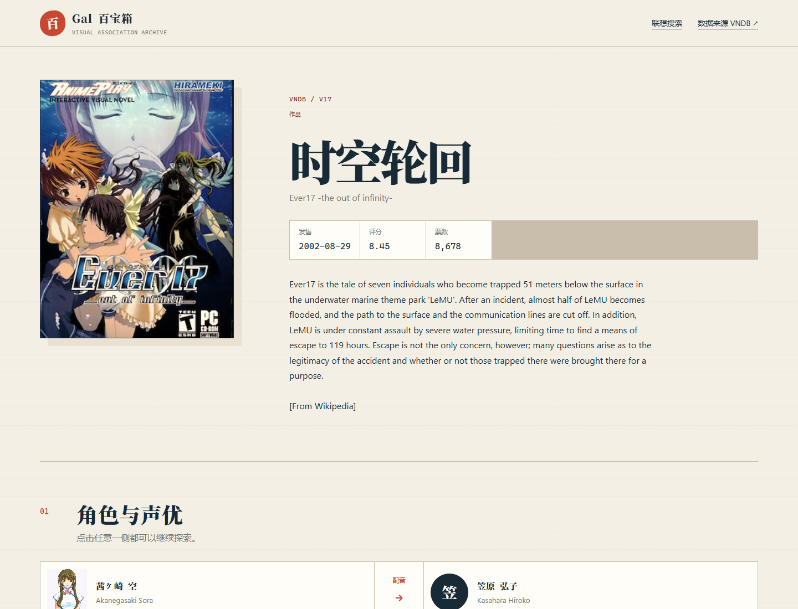
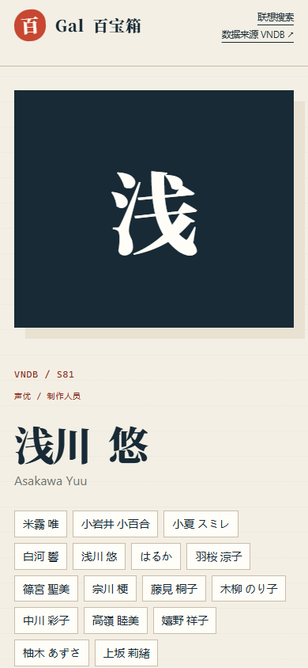

# Gal 百宝箱

面向中文 Galgame 用户的图像化、联想化知识探索工具。数据来自 VNDB Kana API。

当前仓库已实现两个可互通的最小闭环：

`搜索 VN → 查看封面和配音关系 → 打开角色/声优 → 查看声优配过的角色 → 从角色回到其他 VN`

`搜索 Tag → 查看高评分关联作品 → 打开 VN → 沿 VN Tag 继续探索`

首屏分页为 12 条，接近页尾时自动预取下一页；图片使用固定尺寸骨架、淡入和失败占位，详情请求期间显示完整资料加载场景。

## 项目结构

```text
apps/
  api/   VNDB 适配层、稳定 DTO、限流与 SQLite 缓存
  web/   React Web 客户端
docs/
  mvp-spec.md       MVP 产品规格
  api-contract.md   前后端接口契约
  performance-tags-openapi-spec.md 性能观感、Tag 与 OpenAPI 增量规格
  project-summary.md 长期交接记录
```

## 界面快照





## 本地运行

```powershell
npm.cmd install
npm.cmd run dev
```

- Web: http://localhost:5173
- API: http://localhost:8787
- OpenAPI 文档: http://localhost:5173/api/docs
- OpenAPI JSON: http://localhost:5173/api/v1/openapi.json

## 验证

```powershell
npm.cmd run typecheck
npm.cmd test
npm.cmd run build
```

## 生产部署

生产环境使用单个 Docker Compose 服务并由 Caddy 提供 HTTPS。参见
[`docs/deployment.md`](docs/deployment.md)。当前部署流程为手动发布，不包含
GitHub Actions。

## 数据与许可

- VNDB API 免费使用条款以非商业用途为前提；商业化前需与 VNDB 确认。
- VNDB 数据受其 Data License 约束。
- 图片 URL 指向 VNDB/CDN；本项目不永久镜像图片。
- 声优实体在 VNDB API 中没有头像，界面使用其关联角色图像作为视觉线索。
