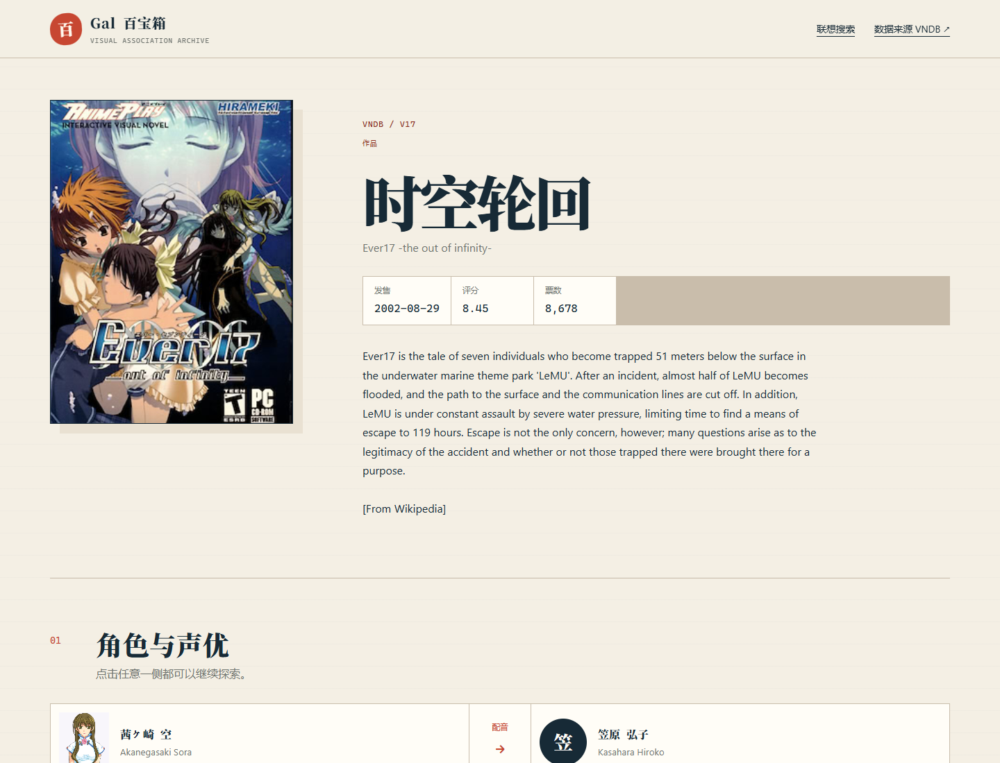
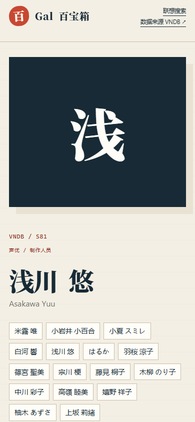

# Gal 百宝箱

面向中文 Galgame 用户的图像化、联想化知识探索工具。数据来自 VNDB Kana API。

生产实例：<https://gtool.minyako.top>

当前仓库已实现两个可互通的最小闭环：

`搜索 VN → 查看封面和配音关系 → 打开角色/声优 → 查看声优配过的角色 → 从角色回到其他 VN`

`搜索 Tag → 查看高评分关联作品 → 打开 VN → 沿 VN Tag 继续探索`

首屏分页为 12 条，后台始终多准备一页但一次只展示一页；卡片在鼠标悬停、键盘聚焦或触屏按下时预取详情。图片使用固定尺寸骨架、淡入和失败占位，详情请求期间显示完整资料加载场景。

Tag 支持简体中文优先显示与中文搜索，英文原名保留为辅助定位。

顶部全局搜索框增加文字左侧留白；桌面侧栏与页脚提供 GitHub 源码入口，移动端可通过页脚访问仓库。


## 项目结构

```text
apps/
  api/   VNDB 适配层、稳定 DTO、限流与 SQLite 缓存
  web/   React Web 客户端
docs/
  mvp-spec.md       MVP 产品规格
  api-contract.md   前后端接口契约
  performance-tags-openapi-spec.md 性能观感、Tag 与 OpenAPI 增量规格
  project-summary.md 长期交接记录
```

## 界面快照





## 本地运行

```powershell
npm.cmd install
npm.cmd run dev
```

- Web: http://localhost:5173
- API: http://localhost:8787
- OpenAPI 文档: http://localhost:5173/api/docs
- OpenAPI JSON: http://localhost:5173/api/v1/openapi.json

## 共享排行榜

`/ranking` 提供 VNDB 公共榜和用户创建的共享榜。首版公共榜取 VNDB 评分最高、至少 100 票的
50 部作品；可以复制为自己的榜单，也可以创建空榜后从 Excel 或搜索添加。这里的“自己的榜单”
表示拥有管理权限，不代表私密：所有人可以查看，登录用户可以贡献自己的评分。

- 邮箱、昵称和密码注册；首版不发验证邮件，也没有邮件找回密码，请妥善保存密码。
- 导入 `.xlsx` 后选工作表及作品名称、评分、extra 评价三列，确认评分为 0–10；每次最多
  50 条、文件最大 5 MiB。`.xls` 请另存为 `.xlsx`，公式请先粘贴为值。
- 导入按 IP 每 60 秒一次。名称会自动匹配 VNDB；不确定或失败的行可以重新搜索、手动选择，
  也可以明确保留未匹配名称。提交前预览，失败不静默跳过。
- 按 VNDB ID 合并作品；每位用户一份评分与评价，再次提交更新自己的记录。用户评分取平均，
  相同分数按 VNDB 评分、中文名称排序。评价在原作品详情页的榜单上下文里显示。
- 创建者可进入编辑，拖动或输入名次，再统一保存。手动顺序优先，排序参考分为目标位置原分数
  +0.1，与十分制用户评分分开；新评分不会覆盖手动顺序，可恢复自动排序。
- VNDB 初始化分数有独立标记，不算作某个用户的投票。榜单一次读取保存的资料快照，不逐条拉取详情。

完整边界、接口、验收及恢复步骤见 [排行榜实施方案](docs/ranking-implementation.md)。

## 验证

```powershell
npm.cmd run typecheck
npm.cmd test
npm.cmd run build
```

## 生产部署

生产环境使用单个 Docker Compose 服务并由 Caddy 提供 HTTPS。当前部署流程为手动发布，不包含
GitHub Actions。VNDB 响应缓存与账号/榜单使用不同 SQLite 文件；进程每小时仅清理缓存中
过期超过 7 天的记录，并保留近期过期数据用于上游故障时的 `STALE` 回退。
账号与榜单不可重建，必须备份；不要删除整个数据卷来清理缓存。详见 [部署与备份](docs/deployment.md)。

## NOTES

移动端适配并没有打磨可能会相对粗糙。
虽然加了种种预加载机制但是加载速度仍然不尽人意，后续可能会进行优化。
介于种种因素，我个人更推荐本地部署获取更好的体验，生产部署不一定能做到长期维持。
还有就是本项目大量使用了Vibe coding，AI代码量超过90%，本人只对制作方案，约束文档以及调用路径做了精修，手工代码只包含前端的某些部分并且都经过了ai的修改，其余部分只是简单review了一下，介意者慎用。（当然你要是愿意帮我细看一下代码我也是大欢迎♥）

## TODOS

- [x] 新增画师搜索的链路（未review，很困，，，）
- [ ] 优化加载速度
- [ ] 美化各个界面
- [x] 共享排行榜首版本地实现与验收（[实施方案与接口](docs/ranking-implementation.md)，待发布）

## 数据与许可

- VNDB API 免费使用条款以非商业用途为前提；商业化前需与 VNDB 确认。
- VNDB 数据受其 Data License 约束。
- 图片 URL 指向 VNDB/CDN；本项目不永久镜像图片。
- 声优实体在 VNDB API 中没有头像，界面使用其关联角色图像作为视觉线索。
- Tag 简体中文翻译来自 [VNDB Profile Search](https://github.com/JodieRuth/VNDB-Profile-Search) contributors，单独按 CC BY 4.0 使用；完整声明见 [THIRD_PARTY_NOTICES.md](THIRD_PARTY_NOTICES.md)。
